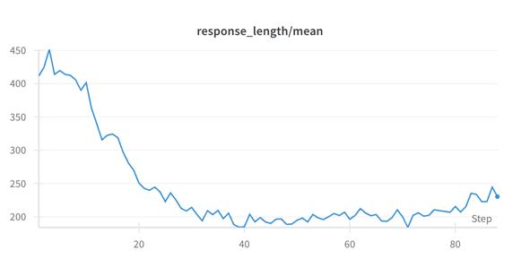

# Math-OCR-Zero
**Math-OCR-Zero:** A high-quality mathematical dataset for reinforcement learning in multimodal large models


Math-OCR-Zero is based on the [VeRL](https://github.com/volcengine/verl) framework and leverages the synthetic OCR-Math dataset to enhance the reasoning capabilities of multimodal large models. It serves as a reproduction of DeepSeek-R1-Zero in the context of multimodal large models.

By generating multimodal data from the [DeepMath-103k](https://huggingface.co/datasets/zwhe99/DeepMath-103K) dataset and applying the GRPO reinforcement learning method, we demonstrate the self-reflection capability of multimodal large models on the qwen2.5-VL-3B-Instruct model.
## Installation
```python
conda create -n math-zero python=3.11
pip install torch==2.6.0
pip install vllm==0.8.4
pip install ray

# verl
pip install -e .

pip install flash-attn --no-build-isolation
pip install wandb matplotlib
```

## Data Preparation
You should first install [latex](https://www.latex-project.org/get/) before running the script.
```sh
python examples/data_preprocess/deepmath_ocr.py --local_dir {your_local_dir} --train_size {your_train_size} --test_size {your_test_size}
```

## Training
```sh
conda activate math-zero
export TRAIN_PATH={your_local_dir}/train.parquet
export VALID_PATH={your_local_dir}/test.parquet
export N_GPUS=4
sh examples/grpo_trainer/run_qwen2_5_vl-3b-deepmath.sh
```

## Datasets
[deepmath-ocr-100000](https://huggingface.co/datasets/minlik/deepmath-ocr-100000)


Here are some samples of the generated images:


## Models

[Qwen2.5-VL-3B-Instruct-GRPO-deepmath-ocr-1k](https://huggingface.co/minlik/Qwen2.5-VL-3B-Instruct-GRPO-deepmath-ocr-1k)





[Qwen2.5-Vl-3B-Instruct-GRPO-deepmath-ocr-7k](https://huggingface.co/minlik/Qwen2.5-Vl-3B-Instruct-GRPO-deepmath-ocr-7k)


## Acknowledge
This project builds upon the following works:

[VeRL](https://github.com/volcengine/verl)

[TinyZero](https://github.com/Jiayi-Pan/TinyZero#)

[Qwen2.5-VL](https://github.com/QwenLM/Qwen2.5-VL)

[DeepMath-103K](https://huggingface.co/datasets/zwhe99/DeepMath-103K)

## To Do
- [ ] Use more data, and train larger models.
- [ ] Mix different open-source datasets to improve model's reasoning and generalization ability.
- [ ] Set different length penalties or rewards based on the difficulty of the task to avoid overthinking on simple tasks.

